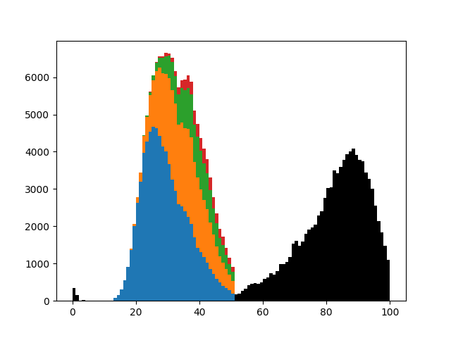

# neworder

[](https://travis-ci.org/virgesmith/neworder) 
[](https://opensource.org/licenses/MIT)

Neworder is a prototype microsimulation package inspired by [openm++](https://ompp.sourceforge.io/) and MODGEN. Models are defined in high-level code (python) and executed within an embedded simulation framework (written in C++) which exposes a subset of itself as a python module. (In order words the C++ framework can call python _and vice versa_).

## Key Features:
- low barriers to entry: users need only write standard python code, little or no new coding skills required.
- flexibility: models are defined entirely in user code.
- reusability: leverage python modules like numpy, pandas.
- speed: embedded C++ framework and module are compiled and optimised code<sup>*</sup>.
- scalability: can be run on a desktop or a HPC cluster, supporting parallel execution using MPI.
- data agnosticism: the framework does not impose any constraints on data sources/formats/databases. 

&ast; For instance, a common requirement in microsimulation is to randomly amend a state (given in a column in a data frame) according to a specified transition matrix. This algorithm requires a loop (i.e. each case dealt with separately) and a python implementation was benchmarked at about 1,500 cases per second. The same algorithm implemented in (compiled) C++ runs some 20,000 times faster, processing the entire test dataset (~120k rows) in under 4 milliseconds.

For detailed information, see:
- [installation](doc/installation.md)
- [API reference](doc/reference.md)

## Proof-of-concept 

The proofs of concept are two variants of a simulation of a population in terms of fertility, mortality and migration by age, gender, ethnicity and location (MSOA<sup>*</sup>) over a 40-year period (2011-2050). The two distinct use cases are:
- desktop: a single-process simulation of a single local authority (initially ~280k people).
- cluster: a highly parallel simulation of England & Wales, starting in 2011 (initially ~56M people).

&ast; after migration an individual's geographic resolution is widened to LAD.

The single local authority case ran in about 25 seconds on a desktop PC. The larger simulation ran on the ARC3 [[2]](#references) HPC cluster, using 48 cores, in under 5 minutes.

## The Framework
The aim is to provide as flexible and minimal a framework as possible. Being data agnostic means that this framework can be run standalone or integrated into workflows where e.g. input data is scraped from the web and results are written to a database. Internally, however, the pandas `DataFrame` is the obvious choice of data structure for this type of modelling. 

In terms of parallel execution, the following use-cases are supported:
- splitting a large problem over multiple cores.
- performing parallel runs with:
  - perturbations to the model dynamics for sensitivity analysis
  - independent RNGs for convergence analysis

### Provision
The framework provides:
- the main "loop" over the timeline. 
- a resettable, independent<sup>*</sup> random number stream per process. (MT19937)
- a parallel execution framework supporting:
  - modes for sensitivity analysis and convergence analysis:
    - the ability to modify the inputs/dynamics for each process.
    - the ability to run each process with either independent or identical random number streams. 
  - interprocess communication and synchronisation
- a library of Monte-Carlo methods.
- a mechanism to specify python code to be run during the course of the simulation (i.e. deferred).
- fast implementations of common algorithms that require explicit loops. (e.g. one benchmarked at over 4 orders of magnitude faster than a pure python implementation.) 
- a logging framework.

Where possible, the functionality available in existing python libraries should be used. The framework specifically does not provide:
- arrays: use numpy wherever possible. The framework can access numpy arrays directly. 
- data frames: use pandas wherever possible. Data frames are accessible in the framework via numpy arrays.

That said, the model developer should avoid loops in python code - its an interpreted language and loops will be executed much more slowly than compiled code.

The section below lists minimal requirements that must be met, and those that - if specified - will be used:

## Requirements
### Compulsory
The framework minimal requirements are that:
- python code to be executed at initialisation, e.g. to load or microsynthesise an initial population, and also load any data governing the dynamics of the microsimulation, e.g. fertility rates.
- python code to evolve the population to the next state, which can (and typically will) involve multiple processes and can be implemented in multiple functions.
- python code to be executed at each checkpoint, typically outputting the evolved population in some form or other.

### Optional
The following are optional:
- a timeline: a start, and end, and a number of steps. (TODO) The timeline can be partitioned, for example for running a 40-year simulation with 1 year timesteps, but outputting results every 5 years. The latter are referred to as "checkpoints", and the end of the timeline is always considered to be a checkpoint.
- code to modify the input data for different processes in a parallel run, for sensitivity analysis.
- functions to call at each timestep to e.g. perform checks that the population remains plausible.

Like MODGEN, both time-based and case-based models are supported. In the latter, the timeline refers not to absolute time but the age of the cohort.

If a timeline is not defined, a single set of transitions is executed.

# Examples

__NB the following are works-in-progress and subject to change, the documentation may not reflect the current code__

__NB note also some of the examples are getting quite complex as they evolve closer to real models - they will be separated in due course__

The microsimulation framework expects a directory containing some python modules. There must be a module called [config.py] that, minimally:
- describes how to initialise model object(s), defined in the other module(s).
- defines a timeline and a timestep. The timeline can be broken into multiple chunks, the end of each of which is considered a _checkpoint_.
- describes what (if any) checks to run after each timestep.
- defines the _transitions_ that the population are subject to during the timeline.
- describes what to do with the simulated population data at each checkpoint.   

All of these are entirely user-definable. The checks, transitions and checkpoints can be empty

To run an example, type 
```bash
$ ./run_example.sh <name> [size [-c]]
```
which will run the model defined in the directory `./examples/<name>`, running optionally over `size` processes, which can be set to use identical RNG streams with the `-c` flag.

## The obligatory "Hello world" example

This example is a simple illustration of the structure required, and all the files are extensively commented. It can be used as a skeleton for new project. 

```bash
$ ./run_example.sh hello_world
[no 0/1] env: seed=19937 python 3.6.6 (default, Sep 12 2018, 18:26:19)  [GCC 8.0.1 20180414 (experimental) [trunk revision 259383]]
[no 0/1] starting microsimulation...
[no 0/1] t=0.000000 initialise: greeter
[no 0/1] t=1.000000 transition: who
[no 0/1] t=1.000000 check: eval
[no 0/1] t=1.000000 checkpoint: say_hello
[py 0/1] Hello neworder_user
[no 0/1] SUCCESS
```
### Understanding the workflow and the output

Defining a timeline for the model is compulsory. This example doesn't really require one, so [config.py](examples/hello_world/config.py) specfies the simplest possible:

The environment initialises, indicating the random seed and the python version used:
```
[no 0/1] env: seed=19937 python 3.6.6 (default, Sep 12 2018, 18:26:19)  [GCC 8.0.1 20180414 (experimental) [trunk revision 259383]]
[no 0/1] starting microsimulation...
```
As no timeline has been specified, we just have single timestep and a single checkpoint (the end). The model is initialised:
```
[no 0/1] t=0.000000 initialise: greeter
```
...an object is constructed and assigned to the variable `greeter`. In [config.py](examples/hello_world/config.py), from the module `greet`, construct an object of type `Greet`, passing no parameters:
```
neworder.initialisations = {
  "greeter": { "module": "greet", "class_": "Greet", "parameters": [] }
}
```
The time loop now increments, and the transitions are processed:
```
[no 0/1] t=1.000000 transition: who
```
The transition named 'who' simply executes the `get_name()` method of the `greeter` object. (If you look in [greet.py](examples/hello_world/greet.py) you will see that the method uses an operating system call to get the username.)
```
neworder.transitions = { 
  "who": "greeter.get_name()"
}
```
Optionally, checks can be implemented to run after each timestep, to check the state of the microsimulation. In [config.py](examples/hello_world/config.py), we have defined:

```json
neworder.do_checks = True
neworder.checks = {
  "eval": "True",
}
```
and thus see the corresponding
```
[no 0/1] t=1.000000 check: eval
```
in the output. The check must evaluate to a boolean, and if `False` the model will stop. In this example the dummy check simply evaluates `True` (which is of course `True`).

We have now reached the end of the timeline and the checkpoint code - call the () method (i.e. `__call__`) of the greeter object
```
neworder.checkpoints = {
  "say_hello" : "greeter()",
}
```
...which says hello:
```
[no 0/1] t=1.000000 checkpoint: say_hello
[py 0/1] Hello neworder_user
```

Finally the framework indicates the model ran successfully:
```
[no 0/1] SUCCESS
```

In the output above, each line has a prefix in square brackets contains the following information for debugging purposes:
- Source of message: `no` if logged from the framework itself, `py` if logged from python code (via the `neworder.log()` function).
- the process id ('rank' in MPI parlance) and the total number of processes ('size' in MPI parlance) - in serial mode these default to 0/1.

The 'model' configuration is here: [examples/hello_world/config.py](examples/hello_world/config.py). This file refers to a second file in which the "model" is defined, see [examples/hello_world/greet.py](examples/hello_world/greet.py)


## Diagnostics

This isn't really an example, it just outputs useful diagnostic information to track down bugs/problems, and opens a debug shell so that the neworder environment can be inspected. Below we use neworder interactively to sample 5 stopping times based on a 10% hazard rate:

```
$ ./run_example.sh diagnostics
[no 0/1] env: seed=19937 python 3.6.6 (default, Sep 12 2018, 18:26:19)  [GCC 8.0.1 20180414 (experimental) [trunk revision 259383]]
[py 0/1] MODULE=neworder0.0.0_boost1_65_1
[py 0/1] PYTHON=3.6.6 (default, Sep 12 2018, 18:26:19)  [GCC 8.0.1 20180414 (experimental) [trunk revision 259383]]
[py 0/1] Loaded neworder/boost/python libs:
[py 0/1]   libpython3.6m.so.1.0 => /usr/lib/x86_64-linux-gnu/libpython3.6m.so.1.0 (0x00007ffadf4ea000)
[py 0/1]   libboost_python3-py36.so.1.65.1 => /usr/lib/x86_64-linux-gnu/libboost_python3-py36.so.1.65.1 (0x00007ffadf2ab000)
[py 0/1]   libboost_numpy3-py36.so.1.65.1 => /usr/lib/x86_64-linux-gnu/libboost_numpy3-py36.so.1.65.1 (0x00007ffadf0a0000)
[py 0/1]   libneworder.so => src/lib/libneworder.so (0x00007ffadee70000)
[py 0/1] PYTHONPATH=examples/diagnostics:examples/shared
[no 0/1] starting microsimulation...
[no 0/1] t=1.000000 checkpoint: shell
[starting neworder debug shell]
>>> import neworder
>>> neworder.stopping(0.1, 5)
array([30.43439191, 13.88102712,  1.69985666, 13.28639123,  1.75969325])
>>>
[exiting neworder debug shell]
[no 0/1] SUCCESS
```

[You can use numbers for reference-style link definitions][4]

See [examples/diagnostics/config.py](examples/diagnostics/config.py)

## Microsimulation of People (single area)

In this example, the input data is a csv file containing a microsynthesised 2011 population of Newcastle generated from UK census data, by age, gender and ethnicity. The transitions modelled are: ageing, births, deaths and migrations. 

Ageing simply increments individual's ages according to the timestep. 

Births, deaths and migrations are are modelled using Monte-Carlo sampling (modelling a Poisson process) of distributions parameterised by age, sex and ethnicity-specific fertility, mortality and migration rates respectively, which are drawn from the NewETHPOP[[1]](#references) project.

For the fertility model newborns simply inherit their mother's location and ethnicity, are born aged zero, and have a randomly selected gender (even probability). The migration model is an 'in-out' model, i.e. it is not a full origin-destination model. Flows are either inward from 'elsewhere' or outward to 'elsewhere'.

People who have died are simply removed from the simulation.

Domestic migrations are given by rates per age, sex and ethnicity. Inward migration is based on the population ex-LAD, whereas outward migration is based on the population of the LAD being simulated.

International migrations are absolute (fractional) counts of individuals by age, sex and ethnicity, based on 2011 data. The values are rounded using a total-preserving algorithm. For emigration this presents a compilation: a situation can arise where a person who doesn't actually exist in the population is marked for migration.

Outward migrations are simply removed from the population. (They are not distributed in this model)

NB dealing with competing transitions...

During the simulation, at each timestep the check code computes and displays some summary data: 
- the time
- the size of the population
- the mean age of the population
- the percentage of the population that are female
- the in and out migration numbers

At each checkpoint, the current population is written to a csv file.

See [config.py](examples/people/config.py) for the simulation setup and [population.py](examples/people/population.py) for details of the model implementation. 

The file [helpers.py](examples/people/helpers.py) defines some helper functions, primarily to reformat input data into a format that can be used efficiently.

```bash
$ time ./run_example.sh people
[no 0/1] env: seed=19937 python 3.6.6 (default, Sep 12 2018, 18:26:19)  [GCC 8.0.1 20180414 (experimental) [trunk revision 259383]]
[no 0/1] starting microsimulation...
[no 0/1] t=2011.250000 initialise: people
[no 0/1] t=2012.250000 transition: age
[no 0/1] t=2012.250000 transition: fertility
[no 0/1] t=2012.250000 transition: migration
[no 0/1] t=2012.250000 transition: mortality
[no 0/1] t=2012.250000 check: check
[py 0/1] check OK: time=2012.250 size=281728 mean_age=37.47, pct_female=49.84 net_migration=1409 (23626-23765+2927-1379)
...
[no 0/1] t=2049.250000 transition: age
[no 0/1] t=2049.250000 transition: fertility
[no 0/1] t=2049.250000 transition: migration
[no 0/1] t=2049.250000 transition: mortality
[no 0/1] t=2049.250000 check: check
[py 0/1] check OK: time=2049.250 size=566509 mean_age=40.16, pct_female=49.69 net_migration=27142 (70953-46534+5673-2950)
[no 0/1] t=2050.250000 transition: age
[no 0/1] t=2050.250000 transition: fertility
[no 0/1] t=2050.250000 transition: migration
[no 0/1] t=2050.250000 transition: mortality
[no 0/1] t=2050.250000 check: check
[py 0/1] check OK: time=2050.250 size=594350 mean_age=40.42, pct_female=49.94 net_migration=30095 (75464-48243+6003-3129)
[no 0/1] t=2050.250000 checkpoint: write_table
[py 0/1] writing ./examples/people/dm_E08000021_2050.250.csv
[no 0/1] SUCCESS
```
This 40 year simulation of a population of about 280,000 more than doubling (no exogenous constraints) executed in about 25s on a single core on a desktop machine.

### Parallel Execution

The above model has been modified to run in massively parallel mode using [MPI](https://en.wikipedia.org/wiki/Message_Passing_Interface), for the entire population of England & Wales (approx 56 million people as of 2011 census). The input data is not under source control due to its size, but the 348 input files (one per local authority) are divided roughly equally over the MPI processes. This particular example, with its simple in-out migration model, lends itself easily to parallel execution as no interprocess communication is required. Future development of this package will enable interprocess communication, for e.g. moving people from one region to another.  

The microsimulation has been run on the ARC3[[2]](#references) cluster and took a little over 4 minutes on 48 cores to simulate the population over a 40 year period.

See the [examples/people_multi](examples/people_multi) directory and the script [mpi_job.sh](mpi_job.sh)

# More Examples

Perhaps (or not) surprisingly, calculating the fair value of a financial derivative can be framed as a microsimulation problem, see [here](doc/examples/Option.md).

## MODGEN-based models

### [Microsimulation and Population Dynamics](doc/examples/Modgen_book.md)


We implement some example MODGEN models in *Microsimulation and Population Dynamics* [[3]](#references), and adapt them to run more efficiently in the `neworder` framework.

### Competing

This is a case-based continuous-time microsimulation of the competing risks of (multiple) fertility and mortality. The former is sampled using a nonhomogeneous multiple-arrival-time simulation of a Poisson process, with a minimum gap between events of 9 months. Mortality is sampled using a standard nonhomogeneous Poisson process. A mortality event before a birth event cancels the birth event.

The figure below shows the distribution of up to four births (stacked) plus mortality.




### RiskPaths

RiskPaths is a well-known MODGEN model that is primarily used for teaching purposes.

TODO neworder implementation...

# References

[1] [NewETHPOP](http://www.ethpop.org/)

[2] ARC3 forms part of the HPC facilities at the University of Leeds.

[3] Microsimulation and Population Dynamics: An Introduction to Modgen 12, Belanger, A & Sabourin, P, Springer Series on Demographic Methods and Population Analysis 43, 2017, [https://www.microsimulationandpopulationdynamics.com/](https://www.microsimulationandpopulationdynamics.com/)

[4] Lewis, P. A. and Shedler, G. S. (1979), Simulation of nonhomogeneous Poisson processes by thinning. Naval Research Logistics, 26: 403-413. doi:10.1002/nav.3800260304