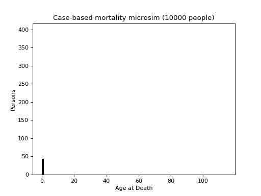

# Chapter 1

This is based on the example given in Chapter 1 of [*Microsimulation and Population Dynamics*](../../README.md#References). It is a basic cohort model using continuous-time case- based simulation of mortality (only) for a homogeneous population. There are two variants, given by the examples [Chapter_1](../../examples/Chapter_1/config.py) and [Chapter_1a](../../examples/Chapter_1a/config.py). The former is a direct reimplementation of a MODGEN model using the same data structures, and uses a constant mortality hazard rate. 

The second example uses an age-specific mortality rate and has two implementations - a direct MODGEN port: [person.py](../../examples/Chapter_1a/person.py), and a reimplementation taking advantage of python packages: [people.py](../../examples/Chapter_1a/people.py). The latter also includes a visualisation of the results:

The mortality data is sourced from the NewETHPOP project (TODO ref) and represents the mortality rate for white British males in one of the London Boroughs.

The "pythonic" implementation uses a pandas dataframe to store the population, as opposed to and array of objects representing for each individual. This a struct-of-arrays rather than array-of-structs approach is, in this instance, far more efficient, running roughly three times quicker.