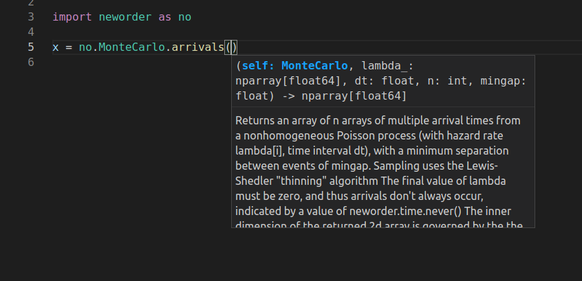

# API Documentation

!!! note "API documentation is no longer provided here."
    As the `neworder` package now contains type annotations, your IDE should display these automatically, e.g.:

    

## Type stubs

Type stubs were generated for the core C++ library using the `pybind11-stubgen` package, although significant editing of the output was required. See `__init__.pyi` for details.
