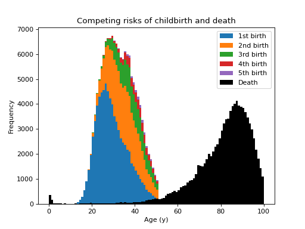
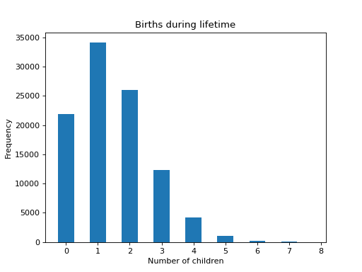

# Competing Risks

This is a case-based continuous-time microsimulation of the competing risks of (multiple) fertility and mortality. The former is sampled using a nonhomogeneous multiple-arrival-time simulation of a Poisson process, with a minimum gap between events of 9 months. Mortality is sampled using a standard nonhomogeneous Poisson process. A mortality event (obviously) precludes any subsequent birth event.

{{ include_snippet("./docs/examples/src.md", show_filename=False) }}

## Inputs

Age- and ethnicity-specfic fertility and mortality rates (females only)

## Implementation

{{ include_snippet("./examples/competing/people.py") }}

## Output

{{ include_snippet("./examples/competing/model.py") }}

Which can be run like so:

```bash
python examples/competing/model.py
```

producing something like

```text
[py 0/1]  birth rate = 1.471500
[py 0/1]  percentage mothers = 78.042000
[py 0/1]  life expexctancy = 81.829173
```

Although we are sampling the same demographic as the [mortality](./mortality.md) example, life expectancy is over 4 years higher because in this example we are only considering females.

The figures below show the distribution of up to four births (stacked) plus mortality,



and the distribution of the number of children born to the cohort:


