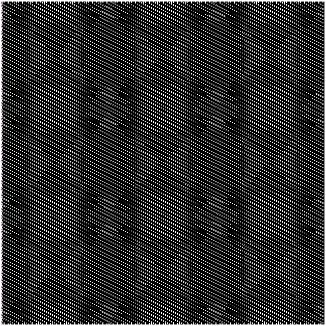

# Conway's Game of Life

An implementation of Conway's cellular automata.

{{ include_snippet("./docs/examples/src.md", show_filename=False) }}

## Inputs

The only inputs are the grid size (2d) and the proportion of cells that are alive initially.

## Implementation

This example uses the `StateGrid` class for efficient neighbour counting, requiring only a few lines of code to evolve a generation (see below). The initial alive cells are sampled randomly according to the proportion set. In each new generation, alive cells with less than 2 or more than 3 neighbours die; empty cells with 3 live neighbours come alive. Dead cells are coloured black, live cells are coloured according to how long they have been alive, from white (youngest) to brown (oldest).

{{ include_snippet("examples/conway/conway.py", "step") }}

## Outputs

The sole output is an animation as shown above.
