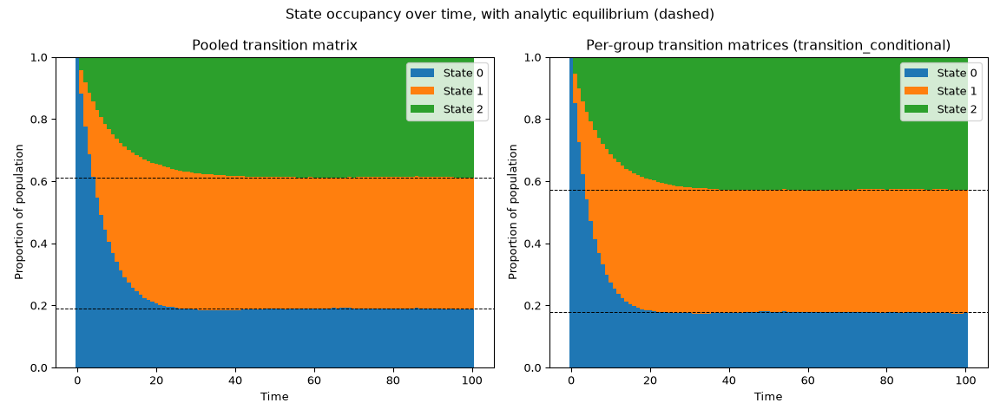

# Markov Chain

This example illustrates how to model a process that consists of probabilistic transitions between discrete states, and showcases how *neworder* can drastically increase performance on certain operations on dataframes.

Firstly we have 3 arbitrary states: 0, 1 and 2. The initial population starts in state 0, and the following transitions are permitted, as described by this transition matrix:

\[
\begin{pmatrix}
1-p_{01}-p_{02} & p_{01}   & p_{02}   \\
0               & 1-p_{12} & p_{12}   \\
p_{20}          & 0        & 1-p_{20}
\end{pmatrix}
\]

Each transition is modelled as a Poisson process with different mean arrival times \(\mu_{ij}=1/\lambda_{ij}\), which generate the probabilities above by \(p_{ij}=\lambda_{ij}.\delta t\)

We use a time horizon of 100 (arbitrary units) with 100 steps and a population of 100000. This equates to computing ten million possible transitions during the model run. The sizes of the populations in each state, as the model progresses, is illustrated below. As you can see an equilibrium state is reached. (NB This means balanced transitions rather than no transitions)

As well as simulating the population, the model computes the *analytic* equilibrium (stationary) distribution of the Markov chain directly from the transition matrix (as the eigenvector corresponding to eigenvalue 1). This is plotted alongside the simulated proportions (dashed lines, below) as a check that the simulation is behaving correctly, and is also logged at the end of the run for comparison against the simulated proportions in the final timestep.

{{ include_snippet("./docs/examples/src.md", show_filename=False) }}

## Performance

The model also implements a pure-python equivalent of the `no.df.transition()` function (`MarkovChain.transition_py()`), for comparison. Set `use_python_impl = True` in `model.py` to use it instead of *neworder*'s C++ implementation.

For the full 100000-person, 100-step model, the C++ implementation takes well under a second (depending on platform), versus about 5s for the python implementation - more than an order of magnitude faster. `no.df.transition` requires the state column to have a pandas `category` dtype (as used here), which also means the state labels don't need to be integers - strings, for example, work just as well - see `no.df.transition` for details.

## Conditional transitions

Alongside the single-matrix simulation above, the model also splits the population into two groups - `fast_to_1` and `fast_to_2` - and runs a second, independent simulation using `no.df.transition_conditional()`, which applies a different transition matrix per row depending on each individual's group. The two group matrices share the same topology as the pooled one above, but with the relative rates out of state 0 biased in opposite directions.

This is deliberately *not* the same as scaling every rate in a group's matrix by a constant factor - doing that leaves the group's equilibrium unchanged, since a Markov chain's stationary distribution depends on the *ratios* between rates, not their absolute magnitude. Instead, each group biases the two routes out of state 0 (towards state 1 vs towards state 2) in opposite directions, so each group settles at a genuinely different equilibrium.

Because group membership never changes, the population as a whole converges to the population-share-weighted average of each group's own equilibrium - not the equilibrium computed from a single matrix applied to everyone (`MarkovChain.stationary_distribution()`). `MarkovChain.mixed_stationary_distribution()` computes this weighted-average equilibrium analytically, and the simulated proportions from the grouped run should match it closely - the same cross-check as the pooled case, but it also demonstrates that pooling heterogeneous subpopulations into one transition matrix can give a materially different (and wrong, for either group) answer than modelling them separately.

## Input

{{ include_snippet("./examples/markov_chain/model.py") }}

## Implementation

{{ include_snippet("./examples/markov_chain/markov_chain.py") }}

## Output

