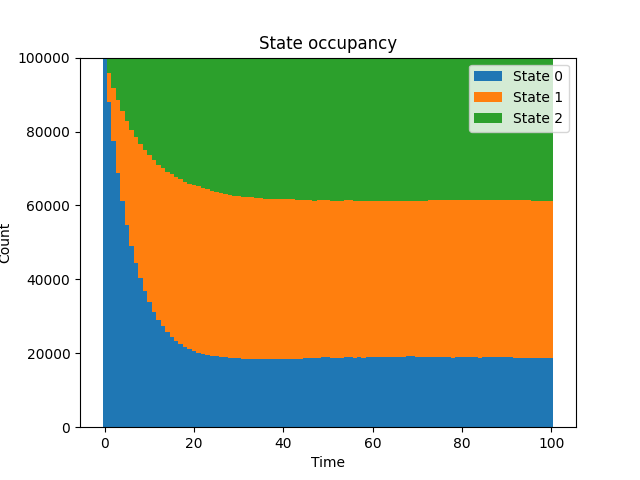

# Markov Chain

This example illustrates how to model a process that consists of probabilistic transitions between discrete states, and showcases how `neworder` can drastically increase performance on certain operations on dataframes.

Firstly we have 3 arbitrary states: 0, 1 and 2. The initial population starts in state 0, and the following transitions are permitted:

- 0 -> 1,
- 0 -> 2,
- 1 -> 2, and
- 2 -> 0

Each transition is modelled as a Poisson process with different mean arrival times.

We use a time horizon of 100 (arbitrary units) with 100 steps and a population of 100000. This equates to computing ten million possible transitions during the model run. The sizes of the populations in each state, as the model progresses, is illustrated below. As you can see an equilibrium state is reached. (NB This means balanced transitions rather than no transitions)

The model `MarkovChain` additionally implements a python-only equivalent of the `neworder.dataframe.transition()` function, which has been optimised to use the pandas `apply()` rather than an explicit loop over the datafame.

The model takes about 45s to run (depending on platform). Changing `MarkovChain.step()` function to use `neworder`'s C++ implementation result in a run time of 4.9s, close to a a factor of 10 speedup.

