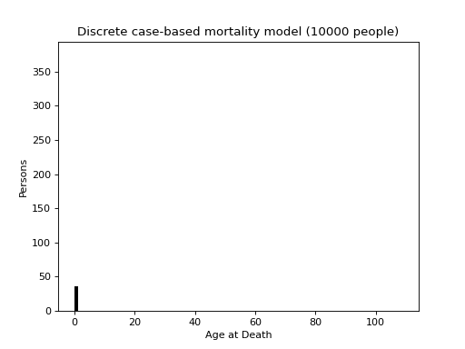

# Microsimulation and Population Dynamics

We implement some example MODGEN models in *Microsimulation and Population Dynamics* [[3]](#references), and adapt them to run more efficiently in the `neworder` framework.

TODO rewrite

## Mortality

This is based on the example in the second chapter of the book - *The Life Table*. It uses an age-specific mortality rate and has two model implementations - a direct MODGEN port: [person.py](../../examples/mortality/person.py), and a re-implementation taking advantage of python packages: [people.py](../../examples/mortality/people.py). The latter also includes a visualisation of the results:

[Mortality](../../examples/mortality/config.py).

 

The mortality data is sourced from the NewETHPOP[[1]](../../README.md#references) project and represents the mortality rate for white British males in one of the London Boroughs.

The "pythonic" implementation uses a pandas dataframe to store the population, as opposed to an array of `Person` objects representing each individual. This a struct-of-arrays rather than array-of-structs approach is, in this instance, far more efficient, running roughly three times quicker. It retains the basic algorithm:
- each year, sample time of death for alive individuals
- if year is not at the end of the mortality table
  - if death occurs within the year, record time of death mark individual as dead
  - otherwise, increment age by 1 and resample
- else
  - record time of death mark individual as dead
- take mean time of death

An even more efficient implementation is to sample the time of death directly using the Lewis-Shedler [[4]](../../README.md#references) "thinning" algorithm - this approach doesn't require a time loop.

