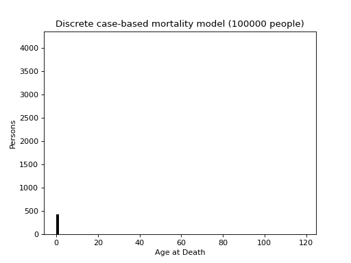
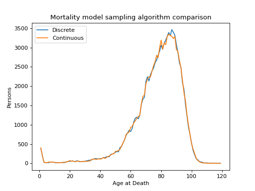

# Mortality

We implement the example *The Life Table* from the second chapter of the book *Microsimulation and Population Dynamics* [[3]](#references). It models mortality in a homogeneous population with an age-specific mortality rate.

This example implments the model in two different ways: firstly a discrete case-based microsimulation, and again using a continuous sampling methodology, showcasing how the latter can be much more efficient. Rather than having a class to represent an individual, as would be standard in a MODGEN implementation, individuals are stored in a pandas `Dataframe` which provides fast iteration over the population.



{{ include_snippet("./docs/examples/src.md", show_filename=False) }}

## Inputs

The mortality data is sourced from the NewETHPOP[[1]](../references.md) project and represents the mortality rate for white British males in one of the London Boroughs. For timeline definition a maximum age of 100 is defined. Note though that the age at death may be higher than this, it's just the cutoff point at which the hazard rate is assumed to be constant.

{{ include_snippet("./examples/mortality/model.py")}}

## Implementation

### Discrete

As per the MODGEN implementation, we step through a case-based timeline and sample deaths using the marginal mortality rate as a (homogeneous) Poisson process, basically:

- each year, sample time of death for alive individuals
- if year is not at the end of the mortality table
    - if death occurs within the year, 
        - record age at death and mark individual as dead
    - otherwise
        - increment age by 1 year and resample
- otherwise
    - record age at death and mark individual as dead
- take mean age at death

So the mortality hazard is treated as a series of piecewise homogeneous Poisson processes.

The discrete model is constructed, as usual, by initialising the base class with a timeline of 100 1-year steps and a seed for the Monte-Carlo engine, loads the mortality data, and initialise the population with age=0 and age at death as yet unknown:

{{ include_snippet("./examples/mortality/people.py", "disc_ctor")}}

The `step` method samples deaths according to the age-specific mortality rate (code not shown for brevity), then increments the age of the living by the timestep.

{{ include_snippet("./examples/mortality/people.py", "disc_step")}}

Finally the `checkpoint` runs after the final timestep, ensures that all individuals are now dead and computes the life expectancy:

{{ include_snippet("./examples/mortality/people.py", "disc_checkpoint")}}

### Continuous

The second implementation samples the term structure of mortality directly using the Lewis-Shedler [[4]](../references.md) "thinning" algorithm - this approach doesn't even require a timeline as each individual's age at death can be sampled directly, as a nonhomogeneous Poisson process.

The continuous model doesn't require a `max_age` argument, as there is no timeline, but it does need to know the time resolution of the mortality data in order to sample it correctly:

{{ include_snippet("./examples/mortality/people.py", "cont_ctor")}}

The step method samples, in a single pass, all the deaths, as arrival times in a nonhomogeneous Poisson process:

{{ include_snippet("./examples/mortality/people.py", "cont_step")}}

The single check ensures that all sampled values are finite:

{{ include_snippet("./examples/mortality/people.py", "cont_check")}}

And finally the checkpoint computes the life expectancy

{{ include_snippet("./examples/mortality/people.py", "cont_checkpoint")}}

## Output

Running the model script will execute both models

```bash
python examples/mortality/model.py
```

with output like this

```test
[py 0/1] Population = 100000
[py 0/1] Discrete model life expectancy = 77.432356, exec time = 1.321355
[py 0/1] Continuous model life expectancy = 77.388072, exec time = 0.161716
```

which illustrates how much more efficient the continuous implementation is (about ten times faster). 

The visualisations (see examples source code for details) show an animated histogram of the deaths (above), and a comparison of the age to death distributions from the two implementations:


