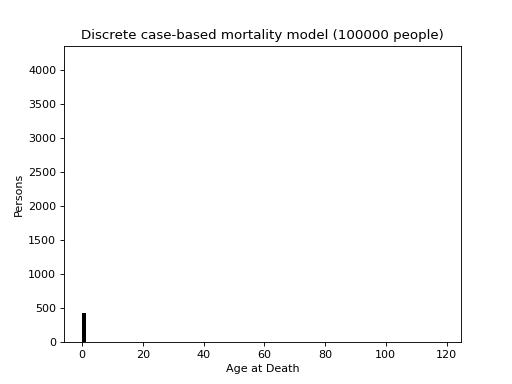
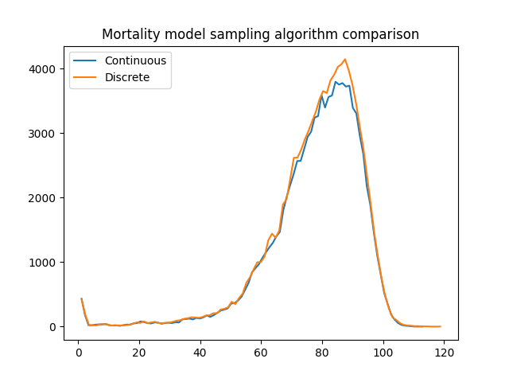

# Mortality

We implement an example MODGEN model in *Microsimulation and Population Dynamics* [[3]](#references), and adapt it to run more efficiently in the `neworder` framework.

## Mortality

This is based on the example in the second chapter of the book - *The Life Table*. It uses an age-specific mortality rate and has two model implementations. Rather than having a class to define each individual, they are store in a pandas `Dataframe` which provides fast iteration over the population. 



The mortality data is sourced from the NewETHPOP[[1]](../../README.md#references) project and represents the mortality rate for white British males in one of the London Boroughs.

The first implementation steps through a case-based timeline and samples deaths using the marginal mortality rate as a series of (homogeneous) Poisson processs, as per the MODGEN example:

- each year, sample time of death for alive individuals
- if year is not at the end of the mortality table
  - if death occurs within the year, record time of death mark individual as dead
  - otherwise, increment age by 1 and resample
- else
  - record time of death mark individual as dead
- take mean time of death

The second implementation samples the term structure of mortality directly using the Lewis-Shedler [[4]](../../README.md#references) "thinning" algorithm - this approach doesn't even require a timeline as each individual's time of death can be sampled directly, as a nonhomogeneous Poisson process.

Running the model script will execute both models

```bash
python examples/mortality/model.py
```

with output like this

```test
[py 0/1] Population = 100000
[py 0/1] Discrete model life expectancy = 77.432356, exec time = 1.321355
[py 0/1] Continuous model life expectancy = 77.388072, exec time = 0.161716
```

which illustrates how much more efficient the continuous implementation is (about ten times faster). Also displayed are an animated histogram of the deaths (above) and another graph comparing the two models:



