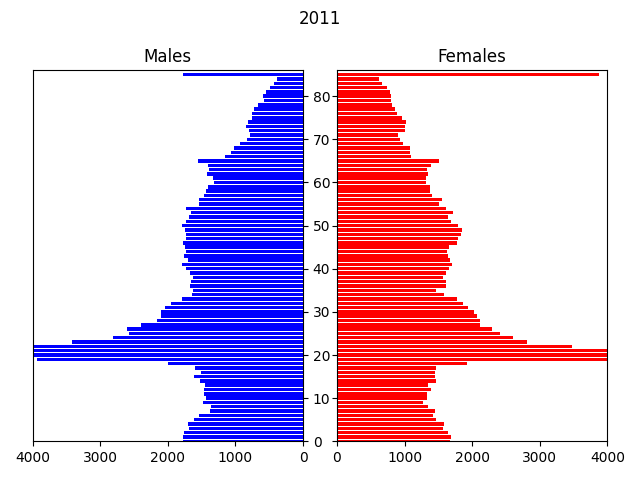

# Population Microsimulation



## Overview

In this example, the input data is a csv file containing a microsynthesised 2011 population of Newcastle generated from UK census data, by age, gender and ethnicity. The transitions modelled are: ageing, births, deaths and migrations, over a period of 40 years to 2051.

Births, deaths and migrations (applied in that order) are modelled using Monte-Carlo simulation (sampling Poisson processes in various ways) using distributions parameterised by age, sex and ethnicity-specific fertility, mortality and migration rates respectively, which are largely fictitious (but inspired by data from the NewETHPOP[[1]](#references.md) project).

For the fertility model newborns simply inherit their mother's location and ethnicity, are born aged zero, and have a randomly selected gender (with even probability). The migration model is an 'in-out' model, i.e. it is not a full origin-destination model. Flows are either inward from 'elsewhere' or outward to 'elsewhere'.

People who have died, and outward migrations are simply removed from the population. (In a larger-scale model migrations would be redistributed).

At each timestep the check method computes and displays some summary data:

- the time
- the size of the population
- the mean age of the population
- the percentage of the population that are female
- the in and out migration numbers

{{ include_snippet("./docs/examples/src.md", show_filename=False) }}

## Setup

{{ include_snippet("examples/people/model.py") }}

## Model Implementation

population.py:

{{ include_snippet("examples/people/population.py") }}

## Execution

From the command line

```bash
python examples/people/model.py
```

## Output

```text
...
[py 0/1]  check OK: time=2045-01-01 size=297562 mean_age=43.82, pct_female=50.31 net_migration=-16.0 (4465.0-4481.0)
[py 0/1]  check OK: time=2046-01-01 size=297078 mean_age=43.93, pct_female=50.33 net_migration=-108.0 (4370.0-4478.0)
[py 0/1]  check OK: time=2047-01-01 size=296672 mean_age=44.06, pct_female=50.34 net_migration=5.0 (4354.0-4349.0)
[py 0/1]  check OK: time=2048-01-01 size=296357 mean_age=44.18, pct_female=50.36 net_migration=114.0 (4453.0-4339.0)
[py 0/1]  check OK: time=2049-01-01 size=295746 mean_age=44.29, pct_female=50.38 net_migration=35.0 (4349.0-4314.0)
[py 0/1]  check OK: time=2050-01-01 size=295269 mean_age=44.39, pct_female=50.38 net_migration=-16.0 (4294.0-4310.0)
[py 0/1]  check OK: time=2051-01-01 size=294468 mean_age=44.50, pct_female=50.39 net_migration=-96.0 (4235.0-4331.0)
[py 0/1]  run time = 20.23s
```

This 40 year simulation of an initial population of about 280,000 executed in about 20s on a single core of a medium-spec machine.
