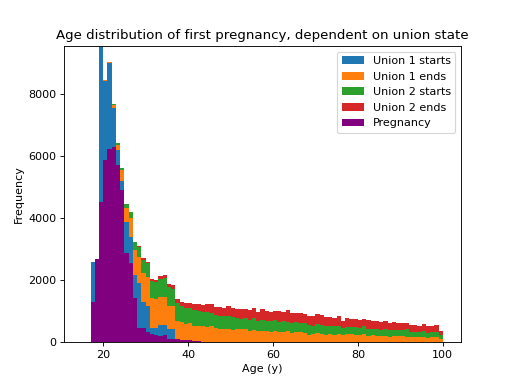

# RiskPaths

RiskPaths is a well-known MODGEN model that is primarily used for teaching purposes and described here[[5]](#references) in terms of the model itself and here in terms of implementation[[6]](#references). It models fertility in soviet-era eastern Europe, examining fertility as a function of time and union state. In the model, a woman can enter a maximum of two unions in her lifetime. The first union is divided into two sections: a (deterministic) 3 year period during which fertility is at a maximum, followed by a (stochastic) period with lower fertility.

Counts of transitions by age: first pregnancy (purple), beginning of first union (blue), end of first union (ochre), start of second union (green), end of second union (red).

Note: the mortality rate used in this model does not have a realistic age structure - events that take place in later years have little bearing on the outcome, which is time of first pregnancy.

{{ include_snippet("./docs/examples/src.md", show_filename=False) }}
