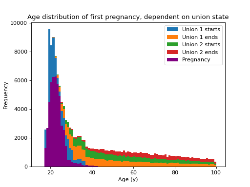

# RiskPaths

RiskPaths is a well-known MODGEN model that is primarily used for teaching purposes and described here[[5]](../references.md) in terms of the model itself and here in terms of implementation[[6]](../references.md). It models fertility in soviet-era eastern Europe, examining fertility as a function of time and union state. In the model, a woman can enter a maximum of two unions in her lifetime. The first union is divided into two sections: a (deterministic) 3 year period during which fertility is at a maximum, followed by a (stochastic) period with lower fertility.



Counts of transitions by age: first pregnancy (purple), beginning of first union (blue), end of first union (ochre), start of second union (green), end of second union (red).

Note: the flat mortality rate used in this model skews mortality events towards younger ages.

{{ include_snippet("./docs/examples/src.md", show_filename=False) }}

## Inputs

The input data is basically refomatted versions of the original inputs (commented) from the MODGEN example:

{{ include_snippet("./examples/riskpaths/data.py") }}

## Implementation

The model implementation is in continuous time, unlike the original MODGEN implementation. Firstly, age at death is sampled for the population, then the time(s) of the union transitions. This former is done in the model constructor:

{{ include_snippet("./examples/riskpaths/riskpaths.py", "ctor") }}

As there are no branching transitions, the times of the events (should they occur) can be sampled directly. The possible transitions, all of which have an impact on the fertility rate, are:

- enter first union, a fixed length "honeymoon" period during which fertility is highest
- enter second phase of first union
- leave first union
- enter second union
- leave second union

Each of these are sampled as an open-ended (i.e. might not happen) nonhomogeneous Poisson process, and events that happen after the individual's sampled age at death are discarded.

Once an individual's union history is known, birth events can be sampled (births have no impact on union status in this model). Thus the `step` method samples union state and then pregnancy (code not show here for brevity):

{{ include_snippet("./examples/riskpaths/riskpaths.py", "step") }}

## Output

Once the end of the timeline has been reached, the `finalise` method:

{{ include_snippet("./examples/riskpaths/riskpaths.py", "finalise") }}

simply prints a couple of summary statistics:

```text
[py 0/1]  mean unions = 0.923190
[py 0/1]  pregnancy ratio = 0.467840
```

The histogram above was generated with code that can be found in the examples, see the links above.