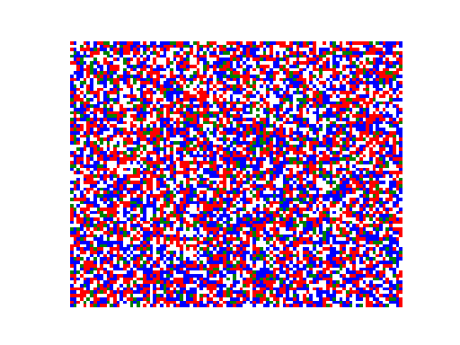

# Schelling's Segregation Model

An implementation of the Schelling ABM [[7]](../references.md)

It's an almost pure python implementation, only using the timeline and logging functionality provided by the neworder framework

In the above example, the similarity threshold is 50% and the cells composition is: 30% empty, 30% red, 30% blue and 10% green, on a 80 x 100 grid.

{{ include_snippet("./docs/examples/src.md") }}
