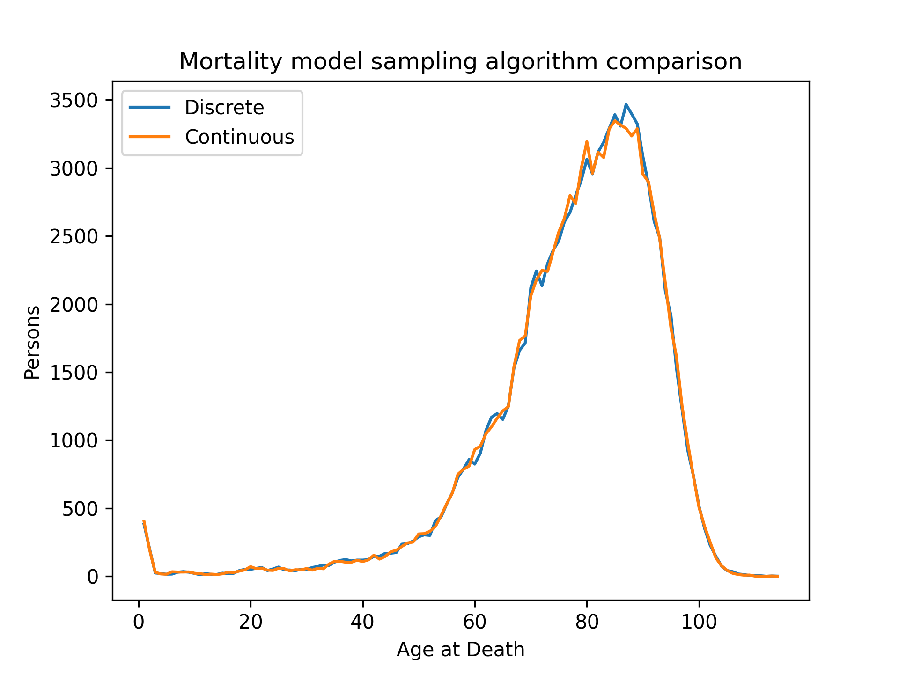

# *neworder*: a dynamic microsimulation framework for python
## Abstract

Traditional microsimulation frameworks typically use a proprietary modelling language, often place restrictions on data formats, and vary in terms of efficiency or scalability. *neworder* provides an efficient, flexible, and scalable framework for implementing microsimulation models using standard python code. Being a framework, it has been designed with reusability and extensibility as primary motivations.

It is implemented in C++ for maximal performance and supports both serial and parallel execution. Particular attention has been paid to provision of powerful and flexible random number and timestepping functionality.

The package is extensively documented, including numerous detailed examples. It is available through the standard python repositories (PyPI, conda-forge) and also as a docker image.

## Rationale

The *neworder* framework is designed to be as unrestrictive and flexible as possible, whilst still providing a solid foundation on which to implement a microsimulation model, with a suite of useful tools. Being agnostic to data formats means that models can be easily integrated with other models and/or into workflows with rigid input and output data requirements.

It supports both serial and parallel execution modes, with the latter being used to distribute computations for large populations or to perform sensitivity or convergence analyses. *neworder* runs as happily on a desktop PC as it does on a HPC cluster.

*neworder* is inspired by @government_of_canada_modgen_2009-1 and, to a lesser extent, the python-based @liam2_nodate tool, and can be thought of as a powerful best-of-both-worlds hybrid of MODGEN and LIAM2.

Both MODGEN and LIAM2 require their models to be specified in proprietary languages (based on C++ and yaml, respectively), whereas our framework eliminates the extra learning curve as users simply define their models in standard python code.

Whilst MODGEN supports parallel execution, LIAM2 does not. MODGEN is very restrictive with input data (which must be defined within the model code) and output data (which is a SQL database). *neworder* supports parallel execution, thus having the scalability of MODGEN, but without any restrictions on data sources or formats.

Both MODGEN and LIAM2 require manual installation and configuration of an environment in order to develop models; *neworder* can simply be installed with one command.

The framework is comprehensively documented [3] and specifically provides detailed examples that are translations of MODGEN models from @belanger_microsimulation_2017 and Statistics Canada @[government_of_canada_general_2009, government_of_modgen_2009], demonstrating how *neworder* implementations can be both simpler and more performant (see the Mortality example in the documentation @[smith_neworder_nodate]).

Part of the design ethos is not to reinvent the wheel and leverage the huge range of statistical functions in packages like *numpy* and *scipy*. However, functions are provided where there is a useful niche function or a major efficiency gain to be had. An example of the former are methods provided to sample extremely efficiently from non-homogeneous Poisson processes using the Lewis-Schedler algorithm @[lewis_simulation_1979], and the ability to perform Markov transitions *in situ* in a pandas dataframe, both of which result in at least a factor-of-ten performance gain.

Another important consideration in *neworder*'s design is reproducibility, especially with regard to random number generators. Inbuilt seeding strategies allow for fully deterministic execution and control over whether parallel processes should be correlated or uncorrelated. User-defined seeding strategies are also supported.

## Acknowledgements

This project is currently supported by Wave 1 of The UKRI Strategic Priorities Fund under the EPSRC Grant EP/T001569/1 and administered through the Alan Turing Institute.

## References
